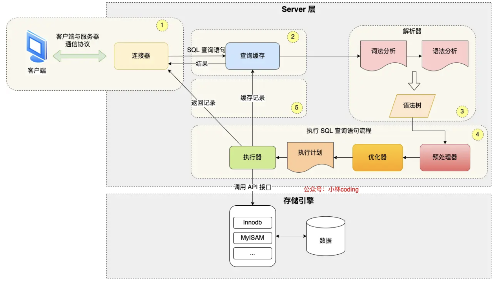
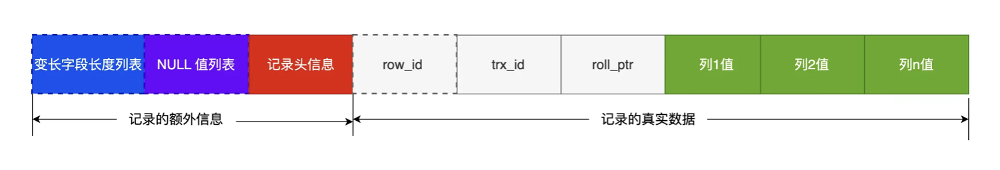
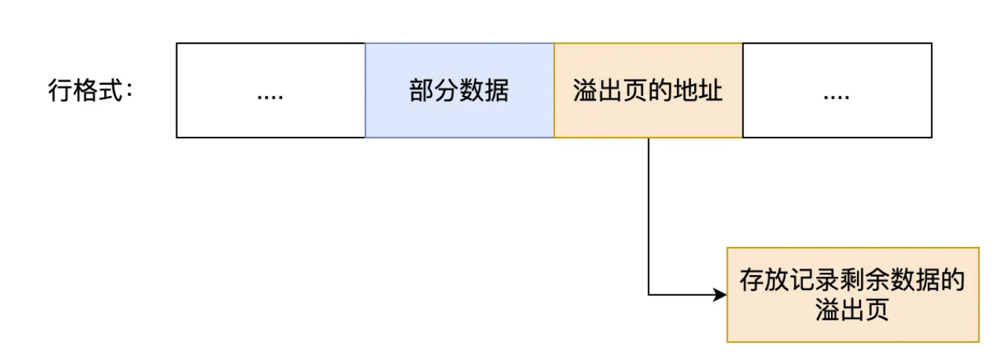
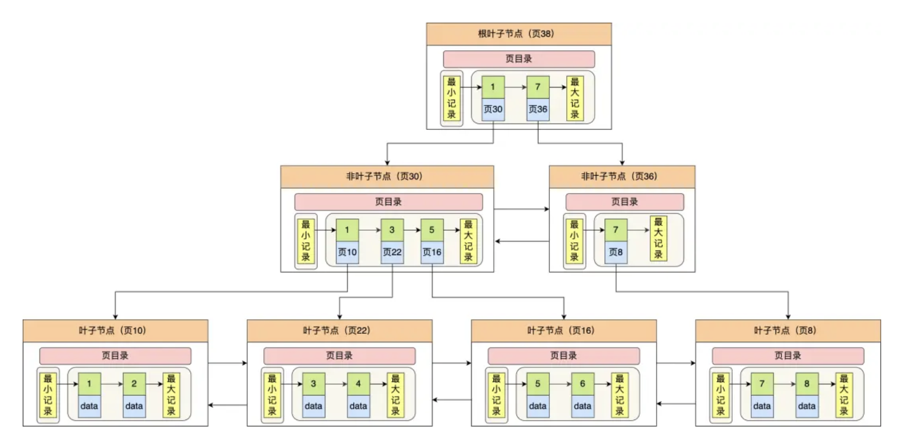

## MySQL

## 一、基础

**1、一条SQL是如何执行的？**

- Server层：负责建立连接，分析和执行SQL。连接、解析、预处理、优化器、执行器
- 存储引擎层：负责数据的存储和提取。

**2、MyIsam和InnoDB的区别**

1.MyISAM 只有表级锁，而InnoDB 支持行级锁和表级锁，默认为行级锁；
2.MyISAM 不提供事务支持。而InnoDB提供事务支持；
3.MyISAM不支持外键，而InnoDB支持；
4.MyISAM不支持聚集索引，InnoDB支持聚集索引；
5MyISAM不支持MVCC，InnoDB支持。应对高并发事务，MVCC比单纯的加锁更高效；

**3、一条数据是如何存储的？**

文件：

​	opt：默认字符集和校验规则

​	frm：表结构

​	ibd：表数据

表空间文件结构：

​	Segment：

​		索引段：B+树中的非叶子结点

​		数据段：B+树中叶子结点

​		回滚段：存放的是回滚数据区的集合，MVCC中版本控制记录。

​	Extent：1MB，如果读取大量数据时，可以以Extent为单位进行读取，因为Page需要读取多次。（索引时可以连续，1MB可以存储连续64个页）

​	Page：InnoDB是按照页来读取的，默认64KB

​	Row：行

**4、InnoDB的行格式？**

- Redundant 
- Dynamic
- Compressed
- Compact

- 变长字段列表：不是必需的，表定义时不用变长字段，变长字段的NULL值不存储。
- NULL值列表：不是必须的，表中都是NOT NULL字段。
- 记录头信息
  - next_record:指向下一条记录的头信息和真实数据之间的位置。
  - type：0普通数据，1为非叶子节点
- 记录真实数据：
  - row_id:没有指定主键或者唯一键自动生成
  - trx_id:事务id
  - roll_pointer:回滚指针

**varchar**

	varchar(n) ：n的最大取值 65535
		MySQL规定除了TEXT、BLOBs这种大对象类型外，其他所有的列（不包括隐藏列和记录头信息）占用的字节长度加起来不能超过65535个字节
		n代表最多存储的字符数量，并不是字节大小；ascii中，1字符占用1字节；UTF-8下1个字符需要3字节。
	  
	varchar(n)存储： 
		真实数据
		真实数据占用的字节数
			变长字段：小于等于255，1字节；大于255，2字节。
			定长字段：
			NULL标识：如果不允许为NULL，这部分不需要
			
	行溢出（指的是页保存不了一行数据）
		一个页大小16KB，varchar(n)最多可以存储65535字节。
		发生行溢出，多的数据存到另外的溢出页中。

## 二、索引

### 1、分类

- 数据结构：B+树索引、Hash索引、Full-text索引
- 物理存储：聚簇索引（主键索引）、二级索引（辅助索引）
- 字段特性：主键索引、唯一索引、普通索引、前缀索引
- 字段个数：单列索引、联合索引

### 2、B+tree结构索引

- 聚簇索引：存储数据的索引
- 覆盖索引：通过二级索引就可以值（主键）
- 回表：需要查两次索引，一次为二级索引B+tree，一次为主键索引

### 3、为什么使用B+tree索引而不是B树索引

- B+tree索引非叶子结点不存储数据，叶子结点才存储数据。
- B索引每个结点都存储数据。
- 由于B+tree的存储数据的特性，能够在相同的空间内覆盖数据的范围大，所以B+tree比较矮胖。
- 单点查询：B树O(1)的复杂度，但是查询波动比较大。B+tree非叶子结点存储更多的索引，查询的IO更小。
- 插入和删除效率：B+tree只需要在叶子结点上进行操作，插入有冗余的结点，插入可能存在节点的分裂（如果节点饱和），但是最多只涉及树的一条路径。
- 范围查询：**B+ 树所有叶子节点间还有一个链表进行连接，这种设计对范围查找非常有帮助**

### 4、什么时候需要索引什么时候不需要？

#### 1、需要索引

- 字段有唯一性限制，比如商品编码。
- 经常用于where查询条件字段，如果查询字段不是一个，可以建立联合索引。
- 经常用于order by和group by的字段，这样排序查询不需要再去做排序，因为建立索引时已经排好序。

#### 2、不需要索引

- 字段有大量重复数据
- 表数据太少
- 经常更新的字段

### 5、索引优化

#### 1、前缀索引优化

- 为了建小索引的大小
- 限制
  - order by无法使用前缀索引
  - 无法把前缀索引用作覆盖索引。

#### 2、覆盖索引优化

- 联合索引可以避免回表

#### 3、主键索引最好是自增（重点，唯一键更新？）

- 数据的存放是按照数据的主键顺序存放的，数据插入时，数据库回根据主键插入到指定的叶子节点中。
- 自增的主键每次插入一条新纪录，都是追加的操作，不需要重新移动数据。
- 非自增主键插入可能是在数据页中间，这就可能要移动其他数据来满足数据的插入，甚至需要复制另外一个页。

#### 4、索引最好设置为NOT NULL

- count会忽略NULL值。
- 至少需要1字节存储NULL值列表。

#### 5、防止索引失效

