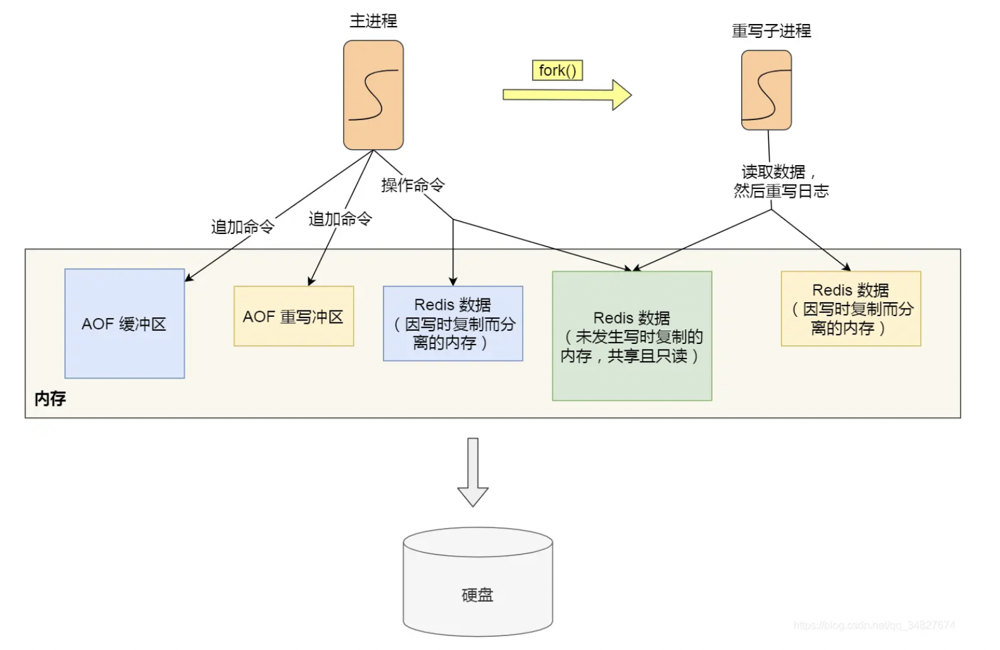

# REDIS

## 一、操作

### 1、key操作

    keys、exists、del、rename、move、type、expire、ttl、persist、scan

### 2、String型操作

####  1.set

    set key value [ex seconds | px milliseconds] [NX | XX]
####  2.setex | psetex (同上ex)

    set key value ex seconds
####  3.setnx (同上nx)   

    set key value nx

####  4.getset key value

    将key的值设为value，并返回旧值

####  5.mset/msetnx key value [key value]

####  6.mget key [key]

####  7.append key value

    127.0.0.1:6379> set s abc
    OK
    127.0.0.1:6379> append s defg
    (integer) 7
    127.0.0.1:6379> get s
    "abcdefg"

####  8.incr/decr key 

    将key存储的数值增一或减一，这个数值只能是整数，不能是小数。
    如果key不存在，先初始化为0，然后再执行增一或减一操作。

####  9.incrbyfloat

####  10.strlen key

####  11.getrange key start end

    返回 key 中字符串值的子字符串，字符串的截取范围由 start 和 end 两个偏移量决定，包括 start 和 end 在内。

####  12.setrange key offset value 

    用 value 参数替换给定 key 所储存的字符串值 str，从偏移量 offset 开始。

### 3、Hash型value操作

####  1.hset key field value[field value]    

    不存在，则创建，返回1
    存在相同的key和field，覆盖旧值，返回0

####  2.hget key field(不存在返回nil)

####  3.hmset key field1 value1 field2 value2...

####  4.hmget key filed1 filed2...

####  5.hgetall key

####  6.hsetnx key filed value

####  7.hdel key filed

####  8.hexists key filed

​    存在返回1，不存在返回0

####  9.hincrby/hincrbyfloat key filed increment 

####  10.hkeys/hvals key

    返回键中所有的域或值

####  11.hlen key

    返回哈希表key中域的大小

####  12.hstrlen key filed

    返回哈希表 key 中， 与给定域 field 相关联的值的字符串长度（string length）

### 4、List型操作

    List按照插入的顺序进行排序，底层实际是一个无头节点的双向链表，所以对列表头和列表尾的操作效率较高，对中间元素的操作效率较低。

####  1.lpush / rpush key value

####  2.llen key：链表长度

####  3.lindex key index

    返回列表中小表为index的元素

####  4.lset key index value

    将列表下标为index的设为value

####  5.lrange key start end

    返回列表 key 中指定区间[start, stop]内的元素，即包含两个端点

####  6.lpushx/rpushx key value

    将值 value 插入到列表 key 的表头/表尾，当且仅当 key 存在并且是一个列表
    如果不是列表就什么也不做，返回0

####  7.LINSERT key BEFORE|AFTER pivot value

    将值 value 插入到列表 key 当中，位于元素 pivot 之前或之后,pivot不存在什么都不做。

####  8.lpop/rpop key [count]   //  blpop/brpop：阻塞式弹出

    从左边/右边弹出几个元素

####  9.rpoplpush source destination

    命令 RPOPLPUSH 在一个原子时间内，执行以下两个动作：
    将列表 source 中的最后一个元素(尾元素)弹出，并返回给客户端。
    将 source 弹出的元素插入到列表 destination ，作为 destination 列表的的头元素。如果 source 不存在，值 nil 被返回，并且不执行其他动作。
    如果 source 和 destination 相同，则列表中的表尾元素被移动到表头，并返回该元素，可以把这种特殊情况视作列 表的旋转(rotation)操作。

####  10.lrem key count value

    根据参数 count 的值，移除列表中与参数 value 相等的元素。count 的值可以是以下几种：
    count > 0 : 从表头开始向表尾搜索，移除与 value 相等的元素，数量为 count 。
    count < 0 : 从表尾开始向表头搜索，移除与 value 相等的元素，数量为 count 的绝对值。
    count = 0 : 移除表中所有与 value 相等的值。

####  11.ltrim key start stop

    对一个列表进行修剪(trim)，就是说，让列表只保留指定区间内的元素，不在指定区间之内的元素都将被删除

### 5、Set型value操作命令

    Set中的Value都是String类型，元素具有无序性与不可重复性。

####  1.sadd key member [member...]

####  2.smembers key 

    返回key中所有的成员

####  3.scard key

    返回set集合的长度

####  4.sismember key member

    判断 member 元素是否集合 key 的成员。

####  5.SMOVE source destination member

    将member从source集合移到destination集合

####  6.srem key member

####  7.srandmember key [count]

    返回集合中的 count 个随机元素。count 默认值为 1

####  8.spop key [count]

    移除并返回集合中的 count 个随机元素。count 必须为正数，且默认值为 1。

####  9.SDIFF key [key …] 或 SDIFFSTORE destination key [key …]

    返回第一个集合与其它集合之间的差集。差集，difference。

####  10.SINTER key [key …] 或 SINTERSTORE destination key [key …]

    返回多个集合间的交集。交集，intersection。

####  11.SUNION key [key …] 或 SUNIONSTORE destination key [key …]

    返回多个集合间的并集。并集，union。

### 6、ZSet有序集合类型操作

    有序 Set 中的每一个元素都有一个分值 score，Redis 会根据 score 的值对集合进行由小到大的排序。

####  1.ZADD key score member [[score member] [score member] …]

    将一个或多个 member 元素及其 score 值加入到有序集 key 中的适当位置。

####  2.ZRANGE key start stop [WITHSCORES] 或 ZREVRANGE key start stop [WITHSCORES]

    返回有序集 key 中，指定区间内的成员。zrange 命令会按 score 值递增排序， zrevrange 命令会按score 递减排序。

####  3.ZRANGEBYSCORE key min max [WITHSCORES] [LIMIT offset count] ZREVRANGEBYSCORE key max min [WITHSCORES] [LIMIT offset count]

    返回有序集 key 中，所有 score 值介于 min 和 max 之间(包括等于 min 或 max )的成员。

####  4.zcard

    返回集合的长度

####  5.ZCOUNT key min max

    返回有序集 key 中， score 值在 min 和 max 之间(默认包括 score 值等于 min或 max )的成员的数量。

####  6.zscore key member

    返回有序集 key 中，成员 member 的 score 值。

####  7.ZINCRBY key increment member

    为有序集 key 的成员 member 的 score 值加上增量 increment 。increment 值可以是整数值或双精度浮点数。

####  8.ZRANK key member 或 ZREVRANK key member

    返回有序集 key 中成员 member 的排名。zrank 命令会按 score 值递增排序，zrevrank 命令会按 score 递减排序。
    score最小的排名为0

####  9.ZREM key member [member …]

    移除有序集 key 中的一个或多个成员，不存在的成员将被忽略。

## 二、底层数据结构

### 1、String

    底层数据结构实现主要为int和SDS（简单动态字符串）


- SDS不仅可以保存文本格式，也可以保存二进制数据。
- 获取字符串长度的时间复杂度为O(1)
- **Redis 的 SDS API 是安全的，拼接字符串不会造成缓冲区溢出**。

**应用场景**

- 缓存对象
- 常规计数：Redis是单线程，执行命令过程是原子性的，因此 String 数据类型适合计数场景，比如计算访问次数、点赞、转发、库存数量等等。
- 分布式锁
  - SET 命令有个 NX 参数可以实现「key不存在才插入」，可以用它来实现分布式锁：
    - 如果 key 不存在，则显示插入成功，可以用来表示加锁成功；
    - 如果 key 存在，则会显示插入失败，可以用来表示加锁失败。
- 共享session信息
  - 缓存统一的登陆信息，避免频繁重复登录。

### 2、List

List列表是简单的字符串列表，按照顺序进行插入，可以从头部或尾部添加元素。

列表的最大长度为 `2^32 - 1`，也即每个列表支持超过 `40 亿`个元素。

```
底层的实现是由双向链表或者压缩链表实现的
- 列表的个数小于512个使用压缩链表实现，每个元素的值小于64字节
- 不满足上面的情况使用双向链表
Redis3.2之后使用了quicklist替代了压缩列表和双向链表
```


**应用场景**

- 消息队列

### 3、Hash

Hash是一个键值对集合，特别适合存储对象。

```
底层的实现是由双向链表或者压缩链表实现的
- 列表的个数小于512个使用压缩链表实现，每个元素的值小于64字节
- 不满足上面的情况使用哈希表
Redis7.0之后压缩列表数据结构已经废弃，交由listpack数据结构实现
```

**应用场景**

- 缓存对象
  - 购物车等

### 4、Set

set是一个无序并唯一的键值集合，一个集合最多存储2^32-1个元素。


```
底层的实现是由整数集合或者哈希表实现的
- 如果集合中都是整数且元素个数小于512个，Redis底层会使用整数集合作为Set的底层数据结构
- 不满足上面的情况使用哈希表
```

**应用场景**

- 点赞
- 共同关注
- 抽奖活动

### 5、ZSet

相较于set多了一个score的排序属性，分值可以重复，元素不可以重复。

```
底层的实现是压缩列表或跳表实现
- 有序集合个数小于128个，元素值小于64字节，使用压缩列表
- 不满足上面使用跳表

Redis7.0，压缩列表废弃，使用listpack替代。
```

**应用场景**

- 排行榜
- 电话排序

### 6、BitMap

BitMap是位图，是一串连续的二进制数组，可以通过偏移量offset定位元素。

```
底层实现使用String类型作为底层数据结构实现的一种统计二值状态的数据类型。
- String会保存为二进制的字节数组，Redis就把每个字节数组的每个bit位利用起来，用来表示一个元素的二值状态。
```

**应用场景**

- 签到统计
- 判断用户登录状态
- 连续签到用户统计


## 三、高性能IO模型

### 1、Redis单线程

Redis是单线程，Redis的网路IO和键值对读写是由一个线程来完成的。

Redis采用了多路复用机制，使其在网络IO操作中能并发处理大量的客户端请求，实现高吞吐率。

### 2、Redis单线程瓶颈

- 操作bigkey，写入或删除都需要耗费大量的IO。
- 使用复杂度过高的命令。
- 大量的key集中过期：Redis的过期机制是在主线程中执行，大量key集中过期会导致处理一个请求时耗时都在删除过期key，耗时变长。
- 淘汰策略：淘汰策略也是在主线程中执行，当内存超过Redis的内存上限后，每次写入都要淘汰一些key。
- AOF刷盘开启了Always机制：每次写入操作都要刷盘，写入磁盘的速度远慢于内存，会拖慢Redis性能。
- 主从全量同步生成RDB：虽然采用了fork子进程生成数据快照，但fork这个瞬间也是会阻塞整个线程的，实例越大，阻塞时间越久。
- 并发量非常大：单线程读写客户端IO数据存在性能瓶颈，虽然采用了IO多路复用机制，但是读写客户端数据依旧是同步IO，只能单线程依次读取客户端的数据，无法利用到CPU多核。


## 四、AOF持久化

### 1、作用

AOF的作用是解决了Redis宕机之后如何避免数据丢失

### 2、写日志


- 先写内存再写磁盘，避免额外的检查开销，不会阻塞当前写操作的执行。（aof_buffer）

- 只写写操作命令，读操作是不会写的。


- 避免额外的检查开销：写内存成功了才会往aof磁盘写
- 不会阻塞当前写任务：当前的写任务是同步进行的，都是在主线程中进行的，但可能会阻塞下一个写任务。


### 3、AOF同步策略

写入系统内核缓冲区时机（操作系统缓存）和刷写到磁盘的时机

- always：总是，每次写操作命令执行完后，同步将AOF日志数据写回到磁盘。
- everysec：每次写操作命令执行完后，先将命令写入到aof文件的内核缓冲区，然后每隔一秒将缓冲区的内容写回到磁盘。
- no：不由Redis控制写回硬盘的时机，转交给操作系统控制写回的时机，也就是每次写操作命令执行完后，先将命令写入到aof文件的内核缓冲区，再由操作系统决定何时将缓冲区的内容写回到磁盘。


### 4、AOF重写机制

#### 1、作用

Redis为了避免AOF日志文件越来越大，采用了重写机制，当AOF文件超过所设定的阈值，Redis就会启用AOF重写机制，来压缩AOF文件。

#### 2、后台重写

重写过程比较耗时，由后台子线程bgrewriteof来完成。

- 子进程进行AOF重写期间，主进程可以处理其他的任务，避免阻塞主线程。
- 子进程可以和父进程共享内存数据，这个共享数据只能进行读取操作，若使用多线程可能会导致并发问题，需要加锁实现。
- 主进程在操作系统调用fork生成bgrewriteof子进程后，操作系统会把页表复制一份给子进程，这个页表记录着虚拟地址和物理地址映射关系，不会复制物理内存，页表的权限为**只读**。
- **写时复制**：当父进程或子进程对在向这个内存发起写操作时，CPU就会触发**CPU写保护中断**，操作系统就会在写中断函数中进行**物理内存复制**,并且重新设置内存映射关系，将父子进程的权限改为读写权限。

#### 3、造成主进程阻塞的两个阶段

- 主进程fork子进程时，会对数据页表和物理内存的映射关系进行复制，如果数据页表比较大，也会造成一定的阻塞。
- 重写时，主进程修改存在的key时，会造成写时复制，如果修改的key是个big key，则可能会导致复制数据过大，造成阻塞。

#### 4、主进程修改后的key value会和子进程的key value不一致，如何处理？



在重写期间，当Redis执行完一个命令后，后同时将这个命令写入到**AOF缓冲区**和**AOF重写缓冲区**。

在重写完成后，子进程后发送一个信号给主进程，主进程调用信号处理函数，将AOF重写缓冲区追加到新的AOF文件中，对新AOF文件改名，覆盖现有的AOF文件。

#### 5、重写过程发生阻塞的时间

- fork子进程、写时复制。
- 信号函数处理时也会发生阻塞。


## 五、RDB快照的实现

RDB文件的内容是二进制数据，因此恢复数据时，RDB快照的效率会更高一点。

#### 1、快照生成

生成RDB快照的命令有两个**save**和**bgsave**,他们的区别主要是在于是否在主进程中进行实现

- save命令在主进程中实现，由于和执行命令在同一个进程，会导致阻塞主进程。
- bgsave是创建一个子进程去生成RDB文件，避免了主进程阻塞。（创建子进程的过程中会阻塞，参考重写机制--物理内存和虚拟内存地址的映射关系）

```
-- 配置文件redis.conf中写到save代表bgsave，900秒内至少一次修改，300秒内至少10次修改。。。
save 900 1
save 300 10
save 60 10000
```

#### 2、执行快照时，数据被修改怎么办？

写时复制COW：主进程发生写操作时，子进程就会将共享内存进行复制A‘，子进程对复制后的内存A’进行快照，主进程可以实现对共享内存A的写操作，不会影响子进程的快照。但是快照后的数据不包含该写操作，需要等到下一次bgsave才能对这部分数据进行快照。

#### 3、极端情况

- 执行快照时，共享内存都被修改，就导致复制的内存较大，变为原来的2倍，所以在写操作较多的情况，应该留意内存的使用。

#### 4、RDB和AOF合体

##### 1、问题

- AOF记录的命令，恢复时较慢
- RDB恢复较快，但是如果写频率较低，服务器一旦宕机就可能导致数据丢失较大；写频率较多也会导致性能下降

##### 2、混合持久化

```
aof-use-rdb-preamble yes
```

##### 3、实现

在AOF重写时，fork出来的子进程先将与父进程共享内存以RDB的形式追加到新的AOF文件中，主进程处理的操作命令会被记录到重写缓冲区中，重写缓冲区会以增量命令以AOF文件方式写到新的AOF文件中，写完后主进程将新的AOF文件（含有RDB和AOF格式）替换旧的AOF文件。


数据丢失得更少，相比AOF加载速度也会更快。


### 六、BigKey对持久化的影响（包括RDB和AOF）

```
-- 检查bigkeys
redis-cli -h 127.0.0.1 -p 6379 -a 123456 -bigkeys
```


## 七、过期删除策略

### 1、定时删除

### 2、惰性删除

### 3、定期删除

## 八、内存淘汰策略

